# Greybox Prototype — Backgammon (Unity)

**Unity 6000.3.9f1 · URP · UI Toolkit · Money Session / RMC template**

A fully-featured backgammon prototype: physics dice, GNUBG-powered AI, doubling cube, match scoring, bear-off, and an event-driven turn orchestrator. Used as a gameplay-systems and UX research platform.

---

## Table of Contents

1. [Getting Started](#getting-started)
2. [Repository Layout](#repository-layout)
3. [Architecture Overview](#architecture-overview)
4. [Turn Flow](#turn-flow)
5. [Key Patterns](#key-patterns)
6. [Scripts Reference](#scripts-reference)
   - [Runtime — Core Systems](#runtime--core-systems)
   - [Editor Scripts](#editor-scripts)
   - [Test Suites](#test-suites)
7. [Assembly Definitions](#assembly-definitions)
8. [Debugging Guide](#debugging-guide)
9. [Resources & Credits](#resources--credits)

---

## Getting Started

```
1. Clone the repo.
2. Install Unity 6000.3.9f1  (see Unity/ProjectSettings/ProjectVersion.txt).
3. Open the Unity/ folder as a Unity project.
4. Open Unity/Assets/Scenes/Scene01_Intro.unity.
5. Press Play.
```

**In-editor help:** select `Unity/Assets/Documentation/ReadMe.asset` in the Project window to open the Unity ReadMe panel.

**Run tests:** Window > General > Test Runner > Run All (the EditMode suite runs without Play mode).

---

## Repository Layout

```
greybox-prototype/
├── Unity/                            ← Open this in the Unity Editor
│   ├── Assets/
│   │   ├── Scenes/                   ← Scene01_Intro.unity (entry point)
│   │   ├── Scripts/
│   │   │   ├── Runtime/RMC/Backgammon/   ← All game logic (~59 files, ~12 600 lines)
│   │   │   ├── Editor/RMC/              ← Editor tooling (7 files)
│   │   │   └── Tests/                   ← EditMode + one PlayMode suite (~40 files)
│   │   ├── Settings/
│   │   │   ├── UIToolkit/               ← UXML / USS (BackgammonHUD, etc.)
│   │   │   └── Backgammon/              ← ScriptableObject assets (presets, profiles)
│   │   ├── Prefabs/                     ← Dice, checker, board prefabs
│   │   └── Documentation/               ← In-editor ReadMe asset
│   ├── Packages/manifest.json           ← URP, MoreMountains, PlayFab, NiceVibrations
│   └── ProjectSettings/
├── docs/                             ← CI notes, submission checklist
├── scripts/                          ← Shell / Python build helpers
├── Makefile
└── README.md                         ← This file
```

---

## Architecture Overview

```mermaid
graph TD
    subgraph Scene["Scene (Scene01_Intro)"]
        GC["BackgammonGameController\n MonoBehaviour · owns GameState & MatchState\n drives the full turn loop"]
        AIM["BackgammonAiMoveCache\n static LRU cache · disk persistence"]
        ATM["BackgammonAiTurnManager\n AI dice roll state · pacing · timing logs"]
        DRC["BackgammonDiceRollCoordinator\n human dice buffering · opening roll · DiceManager resets"]
        DCN["BackgammonDoublingCubeNegotiator\n cube offer/response guard state"]
        GC -->|delegates| AIM
        GC -->|delegates| ATM
        GC -->|delegates| DRC
        GC -->|delegates| DCN
    end

    subgraph Board["Board & Visuals"]
        BM["BoardManager\n checker placement · move previews · raycasts"]
        BP["BoardPoint\n per-point stack"]
        CK["Checker\n individual piece"]
        BM --> BP
        BM --> CK
    end

    subgraph HUD["HUD & UI"]
        HUD_C["BackgammonHudController\n UI Toolkit · score · panels · cube UI"]
        SNC["ScreenNotificationController\n overlay toasts"]
        DCV["DoublingCubeVisual\n 3-D cube + interaction"]
        HUI["HudUI — component wiring"]
        HUD_C --> SNC
        HUD_C --> DCV
        HUD_C --> HUI
    end

    subgraph Dice["Dice System"]
        DM["DiceManager\n physics spawn · roll lifecycle · UI button"]
        DI["Dice\n physics body · face render"]
        DFH["DiceFeedbackHost\n audio / visual feedback"]
        DS["DiceSet — collection"]
        DST["DiceStop — settle detection"]
        DM --> DI
        DM --> DFH
        DM --> DS
        DI --> DST
    end

    subgraph AI["AI System"]
        AIS["BackgammonAIService\n lazy-loads GNUBG weights · owns SearchEngine"]
        CACHE["BackgammonAiMoveDiskCache\n binary / JSON eval cache"]
        GTA["GnubgTurnAdapter\n GameState → GNUBG format"]
        FACT["BackgammonAIEvaluatorFactory"]
        GPE["GnubgPythonEvaluator\n Python subprocess bridge"]
        LNE["LocalNeuralNetEvaluator\n local C# weights fallback"]
        IEVAL["IBackgammonAIEvaluator"]
        AIS --> CACHE
        AIS --> GTA
        AIS --> FACT
        FACT --> GPE
        FACT --> LNE
        GPE --> IEVAL
        LNE --> IEVAL
    end

    subgraph Rules["Rules & State"]
        BGR["BackgammonGameRules\n static win / gammon / bg detection"]
        BEQ["BackgammonEventQueue\n async action sequencing"]
        DRNG["DeterministicRNG\n reproducible rolls for tests"]
    end

    subgraph Audio["Audio"]
        CAC["CheckerAudioController"]
        DFC["DiceFeedbackController"]
    end

    subgraph Config["Config (ScriptableObjects)"]
        BS["BackgammonSettings"]
        GMP["GameModePresetSo / Library"]
        DAP["DiceAudioProfileSo"]
    end

    GC -->|drives| BM
    GC -->|drives| HUD_C
    GC -->|drives| DM
    GC -->|queries| AIS
    GC -->|sequences via| BEQ
    GC -->|queries| BGR
    GC -->|injects seed into| DRNG
    GC -->|reads| BS
    GC -->|reads| GMP
    BM -->|fires events to| CAC
    DM -->|fires events to| DFC
```



**Key data-flow rules:**
- `BackgammonGameController` is the single source of truth for `GameState` (board positions, dice, move list) and `MatchState` (scores, cube ownership). Nothing else mutates these objects.
- All sequenced async work is pushed through `BackgammonEventQueue`; controllers never `await` inline without enqueuing first.
- `BoardManager` is purely visual — it reads from `GameState` and renders; it never writes game logic state.
- AI evaluations run off-thread; results are cached to disk so repeated positions are instant on subsequent runs.

---

## Turn Flow

```
┌─────────────────────────────────────────────────────────────┐
│  MATCH START                                                 │
│  MatchState init — scores 0-0, doubling cube = 1 (centred)  │
└────────────────────────┬────────────────────────────────────┘
                         │
                         ▼
┌────────────────────────────────────┐
│  OPENING ROLL                      │
│  Both players roll 1 die each.     │
│  Higher value wins; ties re-roll.  │
│  Winner goes first with those dice.│
└──────────────────┬─────────────────┘
                   │
          ┌────────▼────────┐
          │   TURN START    │◄──────────────────────────────────┐
          │  active player  │                                   │
          └────────┬────────┘                                   │
                   │                                            │
      ┌────────────▼─────────────┐                              │
      │  DOUBLE OFFER? (optional)│                              │
      │  Only if cube available  │                              │
      │  to active player.       │                              │
      │  ┌─ Opponent accepts ───►│ cube doubles, game continues │
      │  └─ Opponent drops ─────►│ instant loss (pay current    │
      │                          │ cube value), game ends       │
      └────────────┬─────────────┘                              │
                   │ (no offer / accepted)                      │
      ┌────────────▼─────────────┐                              │
      │  ROLL PHASE              │                              │
      │  DiceManager spawns dice │                              │
      │  Physics settle → values │                              │
      │  (test: DeterministicRNG │                              │
      │   supplies fixed values) │                              │
      └────────────┬─────────────┘                              │
                   │                                            │
      ┌────────────▼─────────────┐                              │
      │  MOVE PHASE              │                              │
      │  Movable sources         │                              │
      │  highlighted             │                              │
      │  Player clicks checker → │                              │
      │  Bezier arc previews     │                              │
      │  legal destinations      │                              │
      │  Player clicks dest →    │                              │
      │  BoardManager applies    │                              │
      │  (one sub-move per die;  │                              │
      │   doubles = 4 sub-moves) │                              │
      │  Undo available each step│                              │
      └────────────┬─────────────┘                              │
                   │                                            │
      ┌────────────▼─────────────┐                              │
      │  WIN CHECK               │                              │
      │  BackgammonGameRules:    │                              │
      │  all checkers borne off? │                              │
      │  Yes → Win / Gammon /    │                              │
      │        Backgammon score  │                              │
      │        × cube value      │                              │
      └────────────┬─────────────┘                              │
                   │ (no win)                                   │
      ┌────────────▼─────────────┐                              │
      │  TURN END                │                              │
      │  Dice reset              │                              │
      │  Swap active player      │──────────────────────────────┘
      │  HUD updated             │
      └──────────────────────────┘

BEAR-OFF  When all of a player's checkers are in their home board
          (points 1–6), move destinations include the bear-off tray.
          Handled transparently in the Move Phase.

GAMMON    Opponent has borne off zero checkers → score × 2.
BACKGAMMON Opponent still has checkers on the bar or in your home
           board → score × 3.
CUBE      CubeValue multiplies all stake calculations at game end.
```

---

## Key Patterns

### Event Queue (`BackgammonEventQueue`)
All sequenced turn actions are pushed as typed events rather than called directly. This keeps the controller's main method thin and makes turn flow deterministic and testable. To add a new sequenced action: create a new event type and enqueue it — do not add inline `await` calls to `BackgammonGameController`.

### Deterministic Testing (`DeterministicRNG`)
`DiceManager` accepts an injected `DeterministicRNG` in test builds. All EditMode tests that exercise the turn flow supply fixed dice values this way. Never call `Random.Range` directly in game logic — always route through the injected RNG so tests remain reproducible.

### AI Evaluator Interface (`IBackgammonAIEvaluator`)
```
IBackgammonAIEvaluator
    ├── GnubgPythonEvaluator   (Python subprocess, full GNUBG weights)
    └── LocalNeuralNetEvaluator (local C# weights, fully offline)
```
`BackgammonAIEvaluatorFactory` selects the implementation at startup based on `BackgammonSettings`. To add a new AI backend: implement `IBackgammonAIEvaluator` and register it in the factory — no changes to `BackgammonAIService` or the controller needed.

### Board State vs Visual State
`GameState` holds logical board positions (`int[26]` point counts). `BoardManager` maintains a parallel visual representation. When applying a move the controller updates `GameState` first, then calls `BoardManager.ApplySingleVisualMove`. These two must stay in sync; divergence is caught by `BackgammonSyncMirrorEditModeTests`.

### ScriptableObject Configuration
All runtime tuning lives in SO assets (`BackgammonSettings`, `GameModePresetSo`, `DiceAudioProfileSo`, etc.). Inspector values on SOs are the single source of truth for gameplay parameters — do not hardcode magic numbers in scripts.

### UI Toolkit (not uGUI)
All HUD elements are UXML/USS under `Unity/Assets/Settings/UIToolkit/`. Bindings are established in `BackgammonHudController`. Do not mix uGUI `Canvas` elements with the UI Toolkit document for in-game HUD.

---

## Scripts Reference

Paths are relative to `Unity/Assets/Scripts/`.

### Runtime — Core Systems

| File | Lines | Description |
|------|------:|-------------|
| `Runtime/RMC/Backgammon/BackgammonGameController.cs` | 2518 | Central MonoBehaviour; owns `GameState` + `MatchState`; drives full turn flow, doubling cube, match scoring, AI integration, event queue |
| `Runtime/RMC/Backgammon/Core/BackgammonAiMoveCache.cs` | 362 | Static LRU cache for AI move, cube-offer and cube-response evaluations; binary + JSON disk persistence |
| `Runtime/RMC/Backgammon/Core/BackgammonAiTurnManager.cs` | 161 | Owns AI physical dice-roll state, pacing delays, and timing log helpers; extracted from controller |
| `Runtime/RMC/Backgammon/Core/BackgammonDiceRollCoordinator.cs` | 173 | Owns human-turn dice buffering, opening-roll state, and all DiceManager reset operations |
| `Runtime/RMC/Backgammon/Core/BackgammonDoublingCubeNegotiator.cs` | 85 | Owns doubling-cube offer/response guard state and ownership rules; extracted from controller |
| `Runtime/RMC/Backgammon/BoardManager.cs` | 1849 | Board visualisation; checker placement; Bezier move previews; point highlighting; bar/bear-off zones; raycast selection |
| `Runtime/RMC/Backgammon/UI/BackgammonHudController.cs` | 1215 | UI Toolkit HUD; score panels; player info; doubling cube UI; wires UXML elements to game state |
| `Runtime/RMC/Backgammon/Core/BackgammonAiMoveDiskCache.cs` | 777 | Binary + JSON on-disk cache for AI move evaluations; keyed by position hash |
| `Runtime/RMC/Backgammon/UI/ScreenNotificationController.cs` | 755 | Full-screen overlay notification system; preset-driven toast messages |
| `Runtime/RMC/Backgammon/Dice/DiceManager.cs` | 688 | Spawns physics dice; manages roll lifecycle; binds UI roll button; fires feedback events |
| `Runtime/RMC/Backgammon/DoublingCubeVisual.cs` | 473 | 3-D doubling cube MonoBehaviour; face rotation; player interaction; cube ownership state |
| `Runtime/RMC/Backgammon/Core/BackgammonAIService.cs` | 391 | High-level AI service; lazy-loads neural net weights; owns `SearchEngine`; selects best move |
| `Runtime/RMC/Backgammon/Audio/CheckerAudioController.cs` | 305 | Routes checker movement sound events to `AudioSource` |
| `Runtime/RMC/Backgammon/Core/GnubgPythonEvaluator.cs` | 268 | Launches Python subprocess; sends position; parses GNUBG move/eval response |
| `Runtime/RMC/Backgammon/Dice/Dice.cs` | 250 | Individual die: physics body, face texture selection, settling detection |
| `Runtime/RMC/Backgammon/Bridge/GnubgTurnAdapter.cs` | 219 | Converts `GameState` into GNUBG-compatible position string |
| `Runtime/RMC/Backgammon/Points/BoardPoint.cs` | 172 | Manages the visual checker stack on a single board point |
| `Runtime/RMC/Backgammon/Dice/DiceFeedbackHost.cs` | 162 | Audio/visual feedback host; routes `DiceFeedbackEvents` to audio clips |
| `Runtime/RMC/Backgammon/Core/DeterministicRNG.cs` | 151 | Seeded RNG for reproducible dice in tests; injectable into `DiceManager` |
| `Runtime/RMC/Backgammon/Core/BackgammonMovePreviewCurve.cs` | 132 | Bezier arc definition for move preview animation |
| `Runtime/RMC/Backgammon/Core/BackgammonEventQueue.cs` | 115 | Async event queue that sequences all in-turn actions without blocking the main thread |
| `Runtime/RMC/Backgammon/Core/BackgammonGameRules.cs` | 108 | Static methods: win detection, gammon and backgammon classification |
| `Runtime/RMC/Backgammon/UI/HudUI.cs` | 106 | Thin component wiring HUD sub-component references |
| `Runtime/RMC/Backgammon/Audio/DiceFeedbackController.cs` | 99 | Routes dice feedback events to `AudioSource` |
| `Runtime/RMC/Backgammon/Settings/BackgammonSettings.cs` | 85 | Master game settings SO: AI mode, stake, match length, debug flags |
| `Runtime/RMC/Backgammon/Core/BackgammonBoardLayout.cs` | 80 | Maps point indices to world/screen positions |
| `Runtime/RMC/Backgammon/Checkers/Checker.cs` | 81 | Individual checker MonoBehaviour; position, color, selection state |
| `Runtime/RMC/Backgammon/Dice/DiceRotationSo.cs` | 67 | SO storing face-up rotation data for all 6 die values |
| `Runtime/RMC/Backgammon/CheckerMaterialPropertyBlockUtility.cs` | 65 | `MaterialPropertyBlock` helper for batch-setting checker colors without material instantiation |
| `Runtime/RMC/Backgammon/Dice/DiceSet.cs` | 54 | Container for a pair of Dice; exposes combined result |
| `Runtime/RMC/Backgammon/Dice/DiceStop.cs` | 48 | Physics component that detects when a die has settled (velocity threshold) |
| `Runtime/RMC/Backgammon/UI/BackgammonDebugPanel.cs` | 47 | In-game debug overlay panel (dev builds) |
| `Runtime/RMC/Backgammon/Debug/BackgammonDebugPositionLibrary.cs` | 46 | Hardcoded board positions for editor and test debugging |
| `Runtime/RMC/Backgammon/Core/TaskExtensions.cs` | 45 | Async helpers: fire-and-forget wrappers, timeout utilities |
| `Runtime/RMC/Backgammon/Core/BackgammonAIEvaluatorFactory.cs` | 42 | Factory that selects `GnubgPythonEvaluator` or `LocalNeuralNetEvaluator` at startup |
| `Runtime/RMC/Backgammon/Audio/DiceFeedbackEventData.cs` | 39 | Event payload for dice feedback triggers |
| `Runtime/RMC/Backgammon/Audio/CheckerSoundEventData.cs` | 38 | Event payload for checker sound triggers |
| `Runtime/RMC/Backgammon/Player/Player.cs` | 37 | Runtime player object: color, display name, AI flag |
| `Runtime/RMC/Backgammon/Core/LocalNeuralNetEvaluator.cs` | 33 | Runs local C# neural net weights; fallback when Python is unavailable |
| `Runtime/RMC/Backgammon/Bridge/GnubgResponseDto.cs` | 32 | DTO for deserialising GNUBG JSON response |
| `Runtime/RMC/Backgammon/Core/BackgammonOpeningRollRules.cs` | 27 | Rules for opening roll (single die each, higher wins, re-roll on tie) |
| `Runtime/RMC/Backgammon/Core/BackgammonMovableDestinations.cs` | 25 | Calculates legal destination points for a selected checker + die values |
| `Runtime/RMC/Backgammon/Player/PlayerData.cs` | 23 | Serialisable player profile (name, avatar, stats) |
| `Runtime/RMC/Backgammon/Core/BackgammonMovableFromPoints.cs` | 24 | Calculates which points have movable checkers given current dice |
| `Runtime/RMC/Backgammon/Core/BackgammonEnginePaths.cs` | 21 | Path constants for GNUBG Python scripts and weight files |
| `Runtime/RMC/Backgammon/Core/GameModeType.cs` | 17 | Enum: `MoneySession`, `MatchPlay`, etc. |
| `Runtime/RMC/Backgammon/Core/IBackgammonAIEvaluator.cs` | 16 | Interface for AI evaluator implementations |
| `Runtime/RMC/Backgammon/Core/MoneySessionConfig.cs` | 16 | Money session parameters (ante, rake, session length) |
| `Runtime/RMC/Backgammon/Dice/DiceAudioProfileSo.cs` | 16 | SO mapping die events to `AudioClip` arrays |
| `Runtime/RMC/Backgammon/Core/BackgammonPlayerRoles.cs` | 14 | Enum / constants for White/Black player role assignment |
| `Runtime/RMC/Backgammon/Scenes/Scene01_Intro.cs` | 13 | Scene bootstrap: wires up managers and starts the game |
| `Runtime/RMC/Backgammon/Core/GameModePresetLibrarySo.cs` | 12 | SO list of all `GameModePresets` |
| `Runtime/RMC/Backgammon/Audio/DiceFeedbackEventType.cs` | 11 | Enum: `Roll`, `Land`, `Settle` |
| `Runtime/RMC/Backgammon/Audio/CheckerSoundEventType.cs` | 8 | Enum: `Place`, `Hit`, `BearOff` |
| `Runtime/RMC/Backgammon/Core/PlayerColor.cs` | 8 | Enum: `White` / `Black` |
| `Runtime/RMC/Backgammon/Core/GameModePresetSo.cs` | 18 | Single game mode preset (rule set + difficulty bundle) |

### Editor Scripts

Paths are relative to `Unity/Assets/Scripts/Editor/`.

| File | Lines | Description |
|------|------:|-------------|
| `RMC/BackgammonBearOffPositionImporter.cs` | 86 | Custom `AssetPostprocessor`: imports bear-off position data files into ScriptableObjects |
| `RMC/ScreenNotificationControllerEditor.cs` | 77 | Custom Inspector for `ScreenNotificationController`: preset preview buttons |
| `RMC/[MyProject]/PlayerData/PlayerDataEditorWindow.cs` | — | `EditorWindow` for editing `PlayerData` assets in a dedicated panel |
| `RMC/DoublingCubeVisualEditor.cs` | 50 | Custom Inspector for `DoublingCubeVisual`: face rotation test controls |
| `RMC/Templates/TemplateEditorMenuItems.cs` | 45 | Menu items under `Tools/RMC` for template scaffolding |
| `RMC/[MyProject]/PlayerData/PlayerDataPropertyDrawer.cs` | — | `PropertyDrawer` for inline `PlayerData` fields |
| `ForceStopPlayMode.cs` | 19 | Editor utility: stops Play mode on domain reload to avoid stale state |

### Test Suites

All tests are EditMode unless noted. Paths relative to `Unity/Assets/Scripts/Tests/`.

| File | Lines | What it covers |
|------|------:|----------------|
| `Editor/RMC/BackgammonStagedTurnFlowEditModeTests.cs` | 981 | Full turn flow stages: roll → move → undo → turn end; largest suite |
| `Editor/RMC/BoardManagerApplySingleVisualMoveEditModeTests.cs` | 472 | `BoardManager` visual move correctness including bar and bear-off |
| `Editor/RMC/DoublingCubeVisualEditModeTests.cs` | 411 | Cube face rotation, ownership transfer, UI state |
| `Editor/RMC/SearchEnginePruneSelectionEditModeTests.cs` | 405 | AI search engine pruning and move-selection logic |
| `Editor/RMC/DiceFeedbackEventRoutingEditModeTests.cs` | 326 | Dice feedback events reach correct audio handlers |
| `Editor/RMC/BackgammonAiMoveCacheEditModeTests.cs` | 307 | Disk cache write / read / invalidation for AI evaluations |
| `Editor/RMC/BackgammonDoubleOfferResponderEditModeTests.cs` | 227 | Doubling cube offer / accept / drop logic |
| `Editor/RMC/BackgammonOracleDivergenceRegressionEditModeTests.cs` | 221 | Regression: AI oracle vs local eval divergence cases |
| `Editor/RMC/BackgammonAnteProgressionEditModeTests.cs` | 217 | Money session ante and stake progression |
| `Editor/RMC/BackgammonHudUxmlEditModeTests.cs` | 210 | UXML element existence and binding sanity |
| `Editor/RMC/ScreenNotificationPresetEditModeTests.cs` | 170 | Notification preset lookup and display correctness |
| `Editor/RMC/BoardManagerVisualUndoHitEditModeTests.cs` | 155 | Visual undo when a hit (bar) move is reversed |
| `Editor/RMC/BackgammonMovePreviewCurveEditModeTests.cs` | 149 | Bezier arc point-sampling correctness |
| `Editor/RMC/BackgammonPipCountEditModeTests.cs` | 145 | Pip count calculation for all board positions |
| `Editor/RMC/DiceManagerResetEditModeTests.cs` | 130 | `DiceManager` reset between turns clears state correctly |
| `Editor/RMC/CheckerSoundEventRoutingEditModeTests.cs` | 131 | Checker sound events route to correct audio controller |
| `Editor/RMC/BackgammonAsyncSearchEditModeTests.cs` | 85 | Async AI search does not block or deadlock |
| `Editor/RMC/BackgammonMovableDestinationsEditModeTests.cs` | 87 | Legal destination calculation for edge cases |
| `Editor/RMC/BackgammonBoardMappingEditModeTests.cs` | 88 | Board index ↔ world position mapping |
| `Editor/RMC/BoardManagerCheckerSourceResolutionEditModeTests.cs` | 77 | Correct checker resolved as source under ambiguous stacks |
| `Editor/RMC/BackgammonMovableFromPointsEditModeTests.cs` | 72 | Legal source-point calculation including bar scenarios |
| `Editor/RMC/CheckerInstantPlacementEditModeTests.cs` | 85 | Checker instantaneous placement (no animation path) |
| `Editor/RMC/BackgammonOpeningRollEditModeTests.cs` | 56 | Opening roll tie-break and winner determination |
| `Editor/RMC/SearchEngineAbHarnessEditModeTests.cs` | 59 | A/B harness for comparing two AI evaluator implementations |
| `Editor/RMC/BoardManagerMovePreviewPointHighlightsEditModeTests.cs` | 59 | Point highlight states during move preview |
| `Editor/RMC/BackgammonAiTimingLogsEditModeTests.cs` | 75 | AI evaluation timing measurements and log output |
| `Editor/RMC/CheckerMaterialPropertyBlockUtilityEditModeTests.cs` | 49 | `PropertyBlock` set/get round-trip correctness |
| `Editor/RMC/DiceFeedbackHostFallbackEditModeTests.cs` | 49 | `DiceFeedbackHost` falls back gracefully when clip is missing |
| `Editor/RMC/DiceFeedbackPrefabMappingEditModeTests.cs` | 50 | Feedback prefab SO entries map to valid assets |
| `Editor/RMC/BackgammonHudLegalSignatureEditModeTests.cs` | 44 | HUD public API surface has not changed (signature guard) |
| `Editor/RMC/BackgammonDebugStartPositionEditModeTests.cs` | 35 | Debug position library entries are valid board states |
| `Editor/RMC/DiceAudioSafetyEditModeTests.cs` | 38 | No `NullReferenceException` when dice audio fires before scene fully loaded |
| `Editor/RMC/BackgammonGameRulesScoringEditModeTests.cs` | 30 | Win / gammon / backgammon detection and score multiplier |
| `Editor/RMC/BackgammonBearOffPositionImporterEditModeTests.cs` | 24 | Asset importer produces correct SO data from source files |
| `Editor/RMC/BackgammonPlayerRolesEditModeTests.cs` | 17 | Player role assignment and swap logic |
| `Editor/RMC/BoardTrayBearOffSizingEditModeTests.cs` | 27 | Bear-off tray sizing scales correctly for checker counts |
| `Editor/RMC/BackgammonSyncMirrorEditModeTests.cs` | 66 | `GameState` vs `BoardManager` visual state stay in sync |
| `Runtime/RMC/Backgammon/BackgammonEventQueueTests.cs` | 129 | **PlayMode** — `EventQueue` sequencing with real MonoBehaviour timing |

---

## Assembly Definitions

| Assembly | Location | Purpose |
|----------|----------|---------|
| `RMC.MyProject.Runtime` | `Scripts/Runtime/` | All production game code |
| `RMC.MyProject.Editor` | `Scripts/Editor/` | Editor tools; references Runtime |
| `RMC.MyProject.Editor.Tests` | `Scripts/Tests/Editor/` | EditMode test suite; references Runtime + Editor |
| `RMC.MyProject.Runtime.Tests` | `Scripts/Tests/Runtime/` | PlayMode test suite; references Runtime |

---

## Debugging Guide

### Turn stuck / won't advance
- Check the current `GameState` enum value in the debugger inside `BackgammonGameController`.
- Set a breakpoint in `BackgammonEventQueue.Process` — is an event sitting unprocessed?
- Dice not settling: lower the velocity threshold on `DiceStop` in its Inspector, or enable `BackgammonSettings.UseFixedDice` to bypass physics entirely.

### AI move never arrives
- Check `BackgammonAIService.IsReady` — weights lazy-load on first call and may not have completed yet.
- Check `BackgammonEnginePaths` — do the Python script paths resolve on the current machine?
- If the cache file is corrupt, delete `Application.persistentDataPath/ai_cache.*` and re-run.
- Set `BackgammonSettings` to use `LocalNeuralNetEvaluator` to isolate whether the issue is in the Python bridge.

### Checker / board visual desync
- Run `BackgammonSyncMirrorEditModeTests` first — a failure here confirms logical vs visual state has diverged.
- In Play mode, locate and call `BoardManager.RebuildFromGameState()` (if exposed) to force a full visual rebuild.
- Audit every code path that mutates `GameState` and ensure the matching `BoardManager` visual update is called immediately after.

### HUD elements missing / wrong
- UXML element names must match exactly what `BackgammonHudController` queries by name. Run `BackgammonHudUxmlEditModeTests` to catch renames.
- For style issues, check the relevant `.uss` file in `Unity/Assets/Settings/UIToolkit/`.

### Doubling cube UI not responding
- `DoublingCubeVisual` is only interactive when `MatchState.CubeOwner` permits the active player to offer. Log `MatchState.CubeOwner` in the controller.
- The 3-D cube visual and the HUD cube widget are separate — both must be updated. Check `DoublingCubeVisual` and `BackgammonHudController.UpdateCubeDisplay`.

### Dice audio silent
- `DiceAudioProfileSo` must have clips assigned for each `DiceFeedbackEventType`.
- `DiceFeedbackHost` silently skips null clips (by design) — see `DiceFeedbackHostFallbackEditModeTests` for expected no-crash behaviour.
- Confirm the SO asset reference is wired in the `DiceManager` Inspector.

### Tests failing after a refactor
- **Signature guard:** `BackgammonHudLegalSignatureEditModeTests` fails on any public API change to the HUD — update the test after intentional API changes.
- **State isolation:** EditMode tests that instantiate `BackgammonGameController` must destroy it in `[TearDown]`. Missing teardown causes cross-test state contamination.
- **Sync mirror:** if `BackgammonSyncMirrorEditModeTests` fails, check that every new move path updates both `GameState` and `BoardManager`.

---

## Resources & Credits

**Key packages** (see `Unity/Packages/manifest.json`):
- URP (Universal Render Pipeline)
- MoreMountains Tools
- PlayFab SDK
- Lofelt NiceVibrations

**CI / deployment:**
- Artifact storage notes: [`docs/ci-artifacts-s3.md`](docs/ci-artifacts-s3.md)
- Submission checklist: [`docs/SUBMISSION.md`](docs/SUBMISSION.md)

**Template / consulting lineage:**
- Samuel Asher Rivello — [SamuelAsherRivello.com](https://www.SamuelAsherRivello.com)
  - [Unity Project Structure best practices](https://samuel-asher-rivello.medium.com/unity-project-structure-a694792cefed)
  - [C# Coding Standards](https://samuel-asher-rivello.medium.com/coding-standards-in-c-39aefee92db8)

